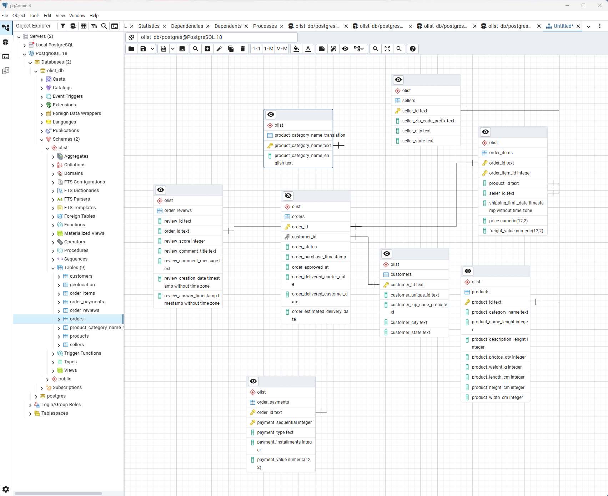
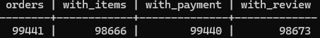

# 📦 Olist SQL Analytics – End-to-End Business Analysis

This project analyzes the **Brazilian Olist e-commerce dataset** using **PostgreSQL** to answer
real-world business questions related to **revenue, customer behavior, delivery performance, and customer satisfaction**.

Rather than focusing on isolated SQL queries, this project emphasizes:
- Business-oriented KPIs
- Order lifecycle analysis
- Delivery delay impact on customer reviews
- Cohort-based customer retention

---

## 🧠 Business Questions

- What are the core business KPIs for delivered orders?
- How does delivery delay affect customer satisfaction?
- Where do orders drop off in the order lifecycle?
- Do customers return after their first purchase?

---

## 🗂️ Data Model (ERD)



The database follows a **relational schema** centered on the `orders` table,
with supporting fact and dimension tables such as:
- `customers`
- `order_items`
- `order_payments`
- `order_reviews`
- `products`
- `sellers`

---

## 📊 Key Findings

### 🚚 Delivery Delay vs Review Score


Orders delayed **more than 15 days** show a sharp increase in **1-star reviews**.
This indicates that **delay duration**, not just delay occurrence,
is the primary driver of customer dissatisfaction.

**Business Implications**
- Prioritize intervention for orders delayed beyond **7 days**
- Set SLA thresholds to prevent extreme delivery delays

---

### 💰 Core Business KPIs (Delivered Orders)


| Metric | Value |
|------|------|
| Total Orders | 96,478 |
| Unique Customers | 93,358 |
| Total Revenue | R$1.32M |
| Average Order Value (AOV) | R$137.04 |
| Revenue per Customer | R$141.62 |

---

### 📦 Order Coverage Validation



This validation confirms that all delivered orders are consistently represented
across `orders`, `order_items`, `order_payments`, and `order_reviews`,
ensuring data integrity for downstream analysis.

---

### 🔁 Customer Retention (Cohort Analysis)


Customer retention drops sharply after the first purchase,
indicating that **repeat purchase is not a strong behavior pattern** in the dataset.

This suggests opportunities for:
- Post-purchase engagement
- Loyalty programs
- Targeted remarketing

---
## 🛠️ SQL Structure & Approach

Each SQL file includes:

- Clear business intent  
- Step-by-step transformations  
- Readable aliases and comments  

---

## 📌 Key Skills Demonstrated

- Advanced SQL (JOINs, CTEs, aggregation, window functions)
- Business KPI design
- Funnel & cohort analysis
- Data validation & quality checks
- Relational data modeling
- Analytical storytelling

---

## 📂 Dataset

- **Source:** Kaggle – Brazilian E-Commerce Public Dataset by Olist  
- **Database:** PostgreSQL 18  
- **Schema:** `olist`

---

## 🚀 Why This Project Matters

This project demonstrates how SQL can be used not only for querying data,  
but for **driving business decisions** through structured analysis,  
clear KPIs, and actionable insights.


## 📁 Repository Structure

```

olist-sql-analytics/
├─ README.md
├─ sql/
│ ├─ 00_setup.sql
│ ├─ 01_staging.sql
│ ├─ 02_marts.sql
│ ├─ 10_kpi.sql
│ ├─ 20_funnel_orders.sql
│ ├─ 30_cohort_retention.sql
│ ├─ 40_delivery_delay_reviews.sql
│ └─ 99_tests.sql
├─ docs/
│ ├─ erd.png
│ ├─ assumptions.md
│ └─ results.md

sql/
├── 00_setup.sql
├── 10_kpi.sql
├── 20_order_lifecycle_funnel.sql
├── 30_cohort_retention.sql
└── 40_delivery_delay_analysis.sql

```
