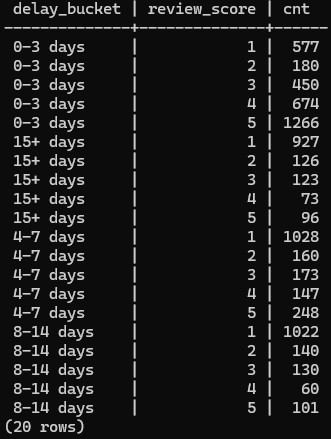

# 📦 Olist SQL Analytics – End-to-End Business Analysis

This project analyzes the **Brazilian Olist e-commerce dataset** using **PostgreSQL**
to answer real-world business questions related to **revenue, customer behavior,
delivery performance, and customer satisfaction**.

Rather than focusing on isolated SQL queries, this project emphasizes:

- Business-oriented KPIs
- Order lifecycle and funnel analysis
- Delivery delay impact on customer reviews
- Cohort-based customer retention
- Data validation and analytical traceability

The goal is to demonstrate how **SQL-driven analytics translate directly into
business decisions**, not just query outputs.

---

## 🧠 Business Questions

- What are the core business KPIs for delivered orders?
- How does delivery delay affect customer satisfaction?
- Where do orders drop off in the order lifecycle?
- Do customers return after their first purchase?

---

## 🗂️ Data Model (ERD)


The ERD above represents the **validated analytical data model**
used throughout this project.

All KPIs and downstream analyses are derived from this schema,
ensuring full **traceability from raw transactional data
to executive-level business insights**.

The model is centered on the `orders` table, with supporting fact
and dimension tables such as:

- `customers`
- `order_items`
- `order_payments`
- `order_reviews`
- `products`
- `sellers`

---

## 📊 Key Findings

### 🚚 Delivery Delay vs Review Score



Orders delayed **more than 15 days** show a sharp increase in **1-star reviews**.
This indicates that **delay duration**, not just delay occurrence,
is the primary driver of customer dissatisfaction.

**Business Implications**
- Prioritize operational intervention for orders delayed beyond **7 days**
- Define SLA thresholds to prevent extreme delivery delays
- Monitor delay buckets rather than binary on-time vs delayed metrics

---

### 💰 Core Business KPIs (Delivered Orders Only)


These KPIs are calculated **exclusively on delivered orders**
to reflect **realized revenue**, providing an executive-accurate
view of business performance.

| Metric | Value |
|------|------|
| Total Orders | 96,478 |
| Unique Customers | 93,358 |
| Total Revenue | R$1.32M |
| Average Order Value (AOV) | R$137.04 |
| Revenue per Customer | R$141.62 |

---

### 📦 Order Coverage Validation


This validation confirms that all delivered orders are
consistently represented across:

- `orders`
- `order_items`
- `order_payments`
- `order_reviews`

Ensuring **data completeness and integrity**
before proceeding to KPI calculation and behavioral analysis.

---

### 🔁 Customer Retention (Cohort Analysis)


Customer retention drops sharply after the first purchase,
indicating that **repeat purchasing is not a strong behavior pattern**
in this dataset.

This cohort-based analysis provides a quantitative foundation for:

- Post-purchase engagement strategies
- Loyalty program design
- Targeted remarketing initiatives

---

## 🛠️ SQL Structure & Approach

Each SQL file in this repository includes:

- Clear business intent
- Step-by-step transformations
- Readable aliases and inline comments
- Explicit filtering and validation logic

The analysis follows a **progressive analytical flow**:
from data setup → validation → KPI calculation → behavioral insights.

---

## 📌 Key Skills Demonstrated

- Advanced SQL (JOINs, CTEs, aggregation, window functions)
- Business KPI design
- Funnel and cohort analysis
- Data validation and quality checks
- Relational data modeling
- Analytical storytelling for decision-making

---

## 📂 Dataset

- **Source:** Kaggle – Brazilian E-Commerce Public Dataset by Olist  
- **Database:** PostgreSQL 18  
- **Schema:** `olist`

---

## 🚀 Why This Project Matters

This project demonstrates how SQL can be used not only for querying data,
but for **driving business decisions** through:

- Clearly defined KPIs
- Validated analytical foundations
- Explainable performance drivers
- Actionable insights aligned with operational and marketing strategy

---

## 📁 Repository Structure

```

olist-sql-analytics/
├─ README.md
├─ data/
│ ├─ raw/ # dataset files (ignored by Git)
│ ├─ processed/ # optional processed data (ignored by Git)
│ └─ .gitignore
├─ sql/
│ ├─ 00_setup.sql
│ ├─ 10_kpi.sql
│ ├─ 20_order_lifecycle_funnel.sql
│ ├─ 30_cohort_retention.sql
│ └─ 40_delivery_delay_analysis.sql
└─ docs/
├─ schema/
│ └─ ERD_Olist_Schema.png
└─ figures/
├─ KPI_Summary.png
├─ Funnel_Order_Coverage_Check.png
├─ Cohort_Retention_Matrix.png
├─ Delay_Bucket_Definition.png
└─ Delay_Bucket_vs_Review_Score.png

```
