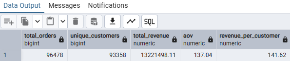
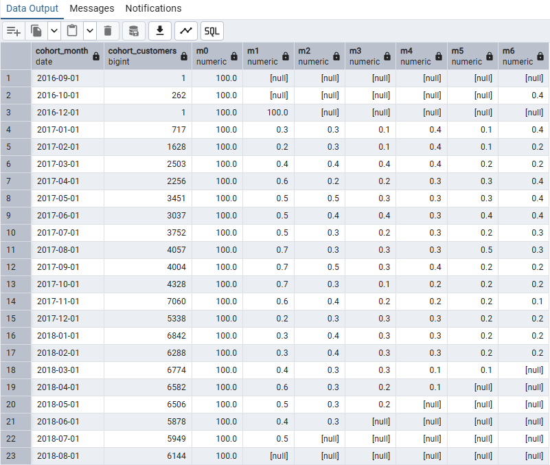

# 📊 Analysis Results & Business Insights

This document summarizes key analytical findings from the **Olist SQL Analytics Project**, focusing on delivery performance, customer satisfaction, and core business KPIs.

---

## 📦 Delivery Delay vs Review Score

Orders delayed **more than 15 days** show a **sharp increase in 1-star reviews**.  
This indicates that **delivery delay duration**, rather than the mere occurrence of delay, is the **primary driver of customer dissatisfaction**.

### Key Insight
- Short delays (≤ 7 days) have limited impact on review scores
- Extreme delays (15+ days) are strongly associated with negative customer feedback

### Business Implications
- **Prioritize operational intervention** for orders delayed beyond **7 days**
- **Define SLA thresholds** to prevent extreme delivery delays
- Use delay duration as an **early-warning signal** for customer experience risk

---

## 📊 Core Business KPIs (Delivered Orders Only)

The following KPIs summarize overall business performance for **successfully delivered orders**.

### KPI Highlights
- **Total Orders**: 96,478  
- **Unique Customers**: 93,358  
- **Total Revenue**: R$1.32M  
- **Average Order Value (AOV)**: R$137.04  
- **Revenue per Customer**: R$141.62  

### Interpretation
- The customer-to-order ratio indicates **low repeat purchase behavior**
- Revenue per customer is only slightly higher than AOV, suggesting limited repeat orders
- Highlights an opportunity to improve **customer retention strategies**

---

## 🧪 Order Coverage Validation

To ensure analytical reliability, order coverage across key transactional tables was validated.

### Validation Result
- Over **99% of orders** have corresponding:
  - Order items
  - Payment records
  - Review data
- Confirms that KPI and review analyses are based on **near-complete order lifecycle data**

---

## 📈 Cohort Retention Overview

Monthly cohort analysis based on customers’ **first purchase month** illustrates retention behavior over time.

### Retention Insight
- Significant drop-off after the first purchase
- Retention stabilizes at a low baseline, indicating:
  - Acquisition-driven growth
  - Limited long-term customer engagement

### Business Opportunity
- Strengthen post-purchase engagement
- Introduce loyalty or reactivation strategies to increase repeat orders

---

## ✅ Summary

This analysis demonstrates how **SQL-driven analytics** can:
- Transform raw transactional data into actionable business KPIs
- Identify operational bottlenecks affecting customer satisfaction
- Support data-informed decisions on **logistics, SLA design, and customer retention**

