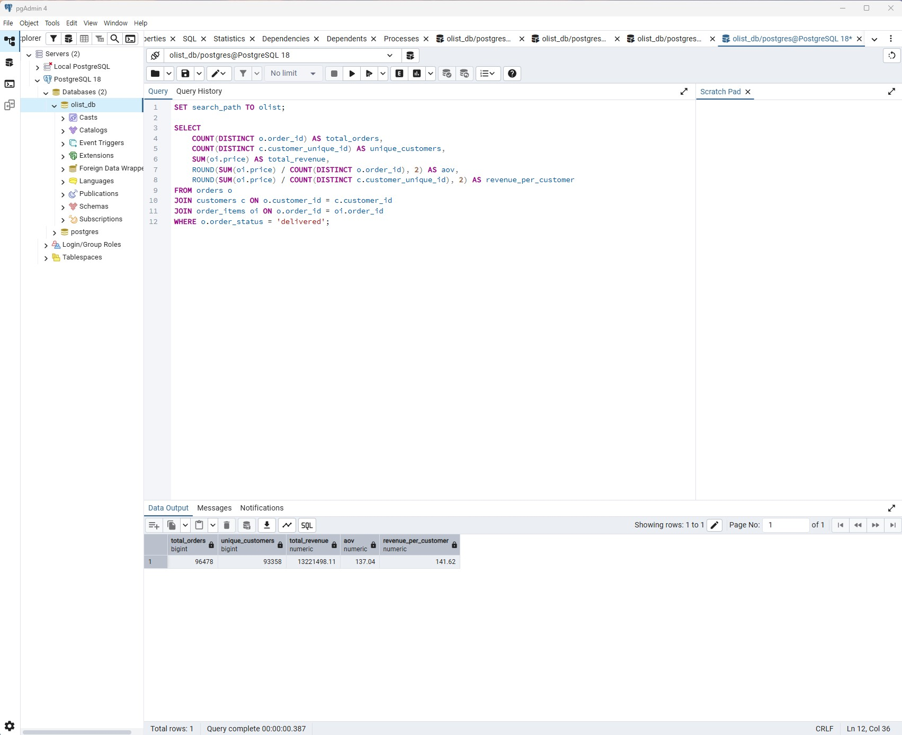

## Delivery Delay vs Review Score

Orders delayed more than 15 days show a sharp increase in 1-star reviews.
This indicates that delivery delay duration, not delay occurrence,
is the key driver of customer dissatisfaction.

Business implication:
- Prioritize intervention for orders delayed beyond 7 days
- Set SLA thresholds to prevent extreme delays

## KPI Summary

- Total Orders: 96,478
- Unique Customers: 93,358
- AOV: 137.04
- Revenue per Customer: 141.62

This KPI snapshot summarizes delivered-order performance across the platform.
